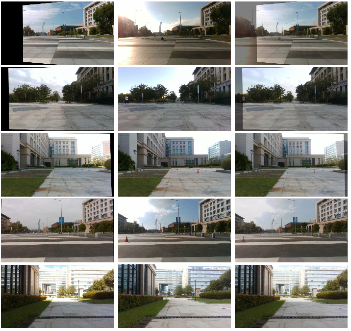
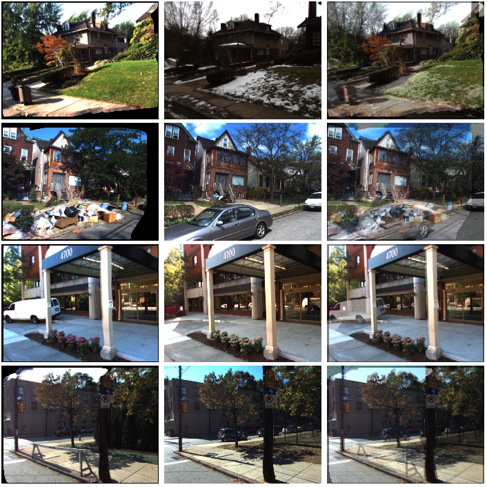
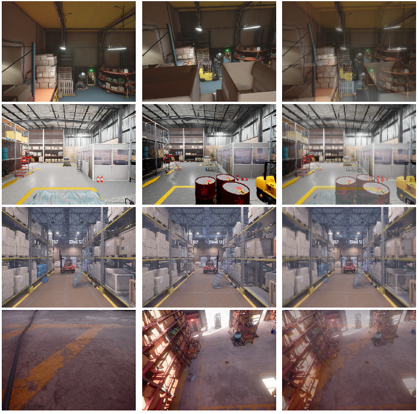
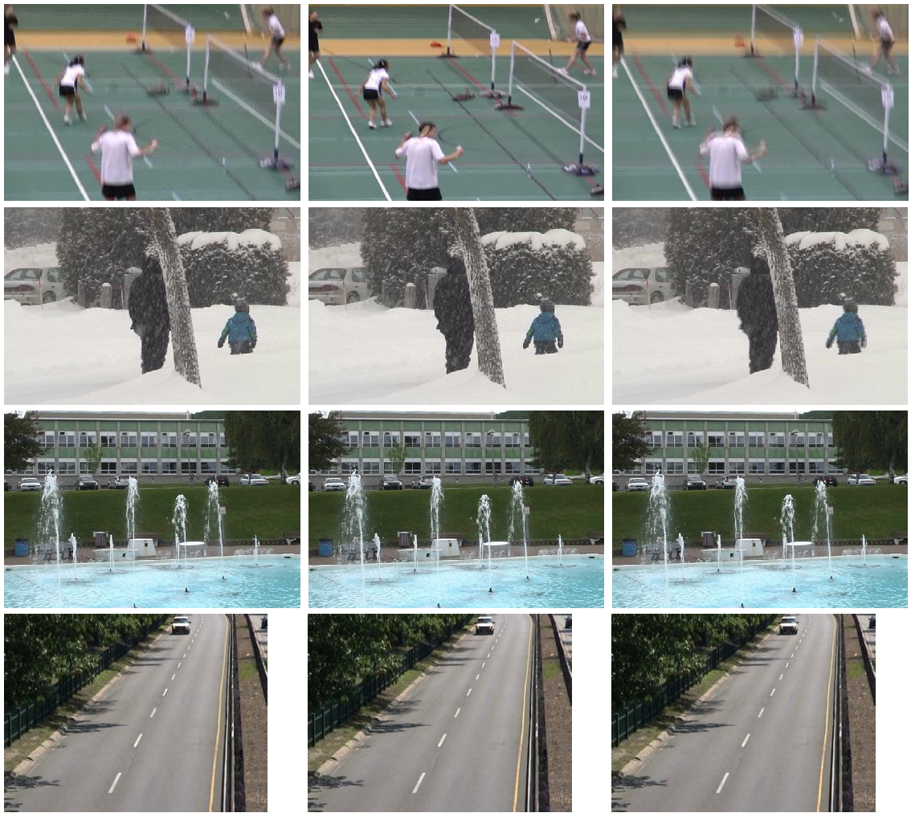
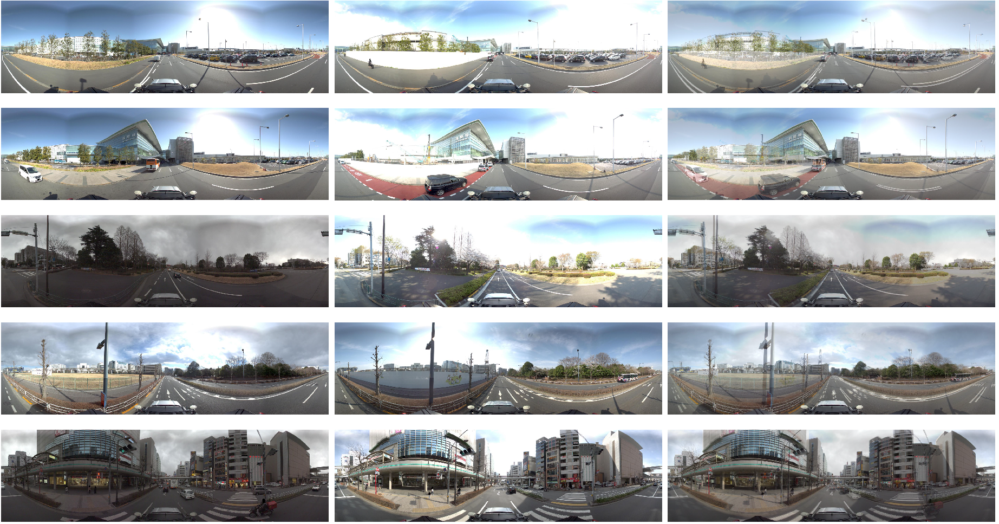

# Comparative Analysis of Image Alignment effects in different Scene Change Detection Datasets

> :grinning: **We believe that high-precision image alignment can achieve high-performance change detection.**

## Ours(UMAD)

**Note**: Not all images in our **UMAD** dataset can achieve this level of alignment effect, but the majority can.

## 1.VL-CMU-CD

**Note**: The **VL-CMU-CD** dataset is the only scene change detection dataset that performed image alignment preprocessing before our dataset. However, VL-CMU-CD dataset utilizes the method of using MVS reconstruction followed by projection for alignment, which results in poor alignment quality and severely disrupts the geometric structure of the images.

## 2.Changesim

**Note**: **Changesim** is a simulated dataset that utilizes RTABMAP for localization and data collection. It introduces Gaussian noise to the waypoints of the trajectory.

## 3.PCD-dataset

**Note**: The **PCD-dataset** consists of two parts: PCD TSUNAMI and PCD GSV. The image shown above is from the PCD GSV part of the dataset.

## 4.CDnet2014-dataset

**Note:** The majority of the data in the **CDnet2014** dataset is captured when the camera is stationary.

## 5.PSCD

**Note**: The **PSCD** dataset is the same as the PCD-dataset.

## Reference

- UMAD: University of Macau Anomaly Detection Benchmark Dataset, 2024
- Street-view change detection with deconvolutional networks, Autonomous Robots 2018
- Changesim: Towards end-to-end online scene change detection in industrial indoor environments, IROS 2021
- Change detection from a street image pair using cnn features and superpixel segmentation, BMVC 2015
- CDnet 2014: An Expanded Change Detection Benchmark Dataset, CVPRW 2014
- Weakly supervised silhouette-based semantic scene change detection, ICRA 2020