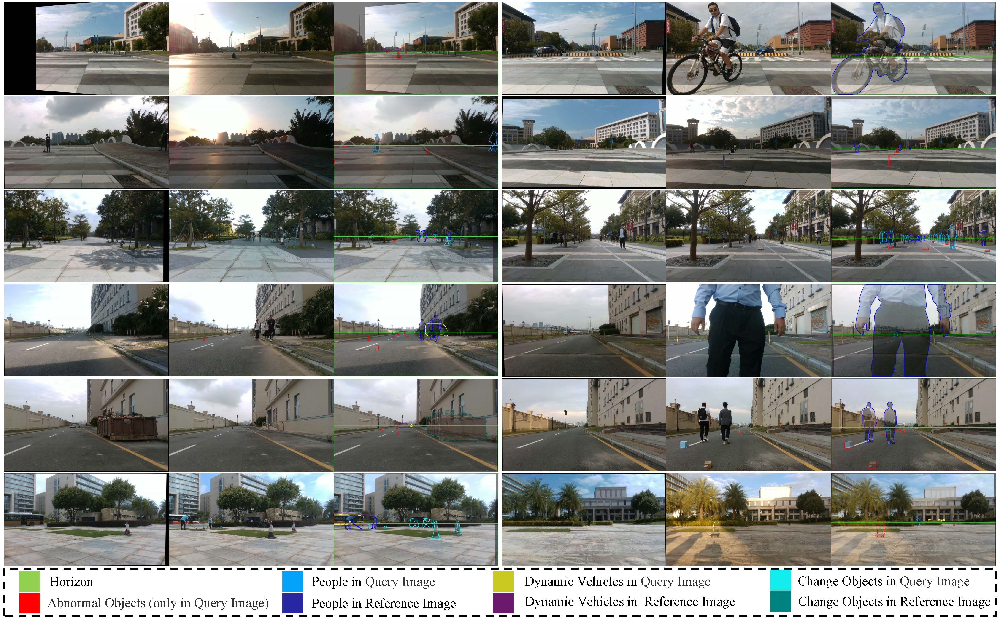
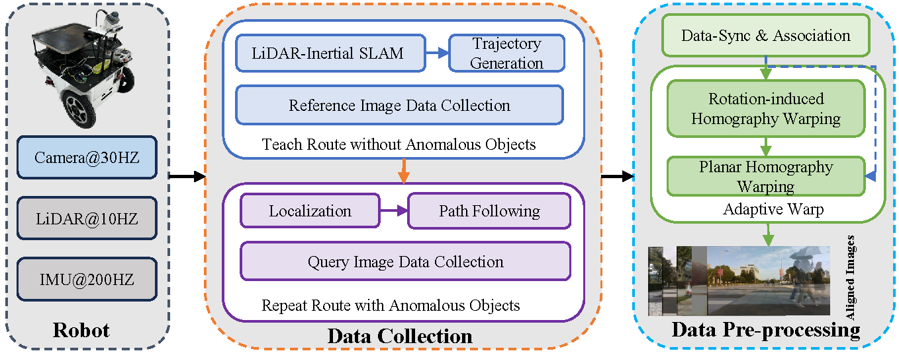

<div align="center">
    <h1>UMAD: University of Macau Anomaly Detection Benchmark Dataset</h2>
    <strong>IROS, 2024.</strong>
    <br>
        <a href="https://scholar.google.com/citations?user=NlsqUHcAAAAJ&hl=en" target="_blank">Dong Li</a>,
        <a href="https://scholar.google.com/citations?user=Fg01Yv0AAAAJ&hl=en&oi=ao" target="_blank">Lineng Chen</a>,
        <a href="https://scholar.google.com/citations?user=XsBBTUgAAAAJ&hl=en" target="_blank">Cheng-Zhong Xu</a>,
        <a href="https://scholar.google.com/citations?user=Glqv2ooAAAAJ&hl=en&oi=sra" target="_blank">Hui Kong</a><sup>†</sup>
    <p>
        <h45>
            University of Macau
            <br>
        </h5>
        <sup>†</sup>Corresponding Authors
    </p>
    <a href="https://ieeexplore.ieee.org/document/10802194"></a>
    <a href="https://arxiv.org/pdf/2408.12527"></a>
    <a href='https://drive.google.com/drive/folders/1UmZ3vA1cOunB-2wgz8T1fJDebhb-gmax?usp=sharing'></a>
    <a href="https://www.youtube.com/watch?v=xORb4H-AyNw"></a>
    <a href="https://github.com/IMRL/UMAD/blob/main/Doc/UMAD-Poster.pdf"></a>
</div>


[](https://www.youtube.com/watch?v=xORb4H-AyNw "UMAD: University of Macau Anomaly Detection Benchmark Dataset")

## [UMAD Dataset Google Drive Link, about 10GB](https://drive.google.com/drive/folders/1UmZ3vA1cOunB-2wgz8T1fJDebhb-gmax), and [UMAD-Dataset-Usage-Guide-Doc](https://github.com/IMRL/UMAD/blob/main/Doc/UMAD-Dataset-Usage-Guide-Doc.md)

## 😊News

This work is maintaining. You can hit the **STAR** and **WATCH** to follow the updates.

- **2024-9-5**: We have released the UMAD-1.0 dataset, along with the robot system code.

- **2024-8-27**: We will update the **UMAD-homo-eva dataset** and the extension experiments on the [UMAD-homo-eva](https://github.com/IMRL/UMAD/blob/main/Doc/UMAD-homo-eva-dataset.md).

- **2024-8-22:** UMAD paper sharing on arXiv~

- **2024/6/30**: **UMAD** has been accepted by **IROS 2024**! Thanks to everyone who participated in this project!

- **2024/3/21**: We have publicly released a supplementary video for the paper submission.

## 📝ToDo List

- [x] Make the project paper publicly available.
- [x] Open-source the UMAD dataset.
- [x] Open-source the UMAD-homo-eval dataset.
- [ ] Open-source the code related to the datasets.
- [x] Open source robotic system code.
- [ ] Release C++/python Adaptive Warping code.

## Dataset

#### Dataset Overview




You can refer to the [UMAD-Dataset-Usage-Guide-Doc](https://github.com/IMRL/UMAD/blob/main/Doc/UMAD-Dataset-Usage-Guide-Doc.md) for information on how to use the UMAD dataset and details about the ground truth mask files.

## Benchmark

#### Anomaly Detection Benchmark

#### Change Detection Benchmark

## System



You can easily collect data or deploy a system like our **UMAD robot system**:

```bash
# Prerequisites: [FAST_LIO](https://github.com/hku-mars/FAST_LIO) and [FAST_LIO_LOCALIZATION](https://github.com/HViktorTsoi/FAST_LIO_LOCALIZATION)

# 1. Build develop environment: Download UMAD's code, and put src/FAST_LIO_LOCALIZATION in the workspace of ROS
git clone https://github.com/IMRL/UMAD
#catkin make

# 2. Build map and record path: Put the robot in the scene, run FAST_LIO and record the waypoints
roslaunch fast_lio mapping_mid360.launch
python3 UMAD/robot_system_code/script/path_record.py # generate a path.txt file

# 3.Control the robot around the environment
# 4.Shut down the fast_lio and waypoint_record scripts.
# 5.Save the scene map output from FAST-LIO

# 6. Collect reference data: put robot back start point, run FAST_LIO_LOCALIZATION and path follow code
python3 UMAD/robot_system_code/script/path_follow.py
rosrun fast_lio_localization publish_initial_pose.py 0 0 0 0 0 0
roslaunch fast_lio_localization localization_mid360.launch map:=/home/imrl/Desktop/3.Central-Avenue.pcd
rosbag record /camera/color/image_raw/compressed /localization

# Assuming a long time has passed, or you have placed some anomalous Objects in the scene.

# 7.Collect query data: put robot back start point, run FAST_LIO_LOCALIZATION and path follow code like 6
python3 UMAD/robot_system_code/script/path_follow.py
rosrun fast_lio_localization publish_initial_pose.py 0 0 0 0 0 0
roslaunch fast_lio_localization localization_mid360.launch map:=/home/imrl/Desktop/3.Central-Avenue.pcd
rosbag record /camera/color/image_raw/compressed /localization
```

## Acknowledgement

The authors would like to thank the following people for their contributions to data collection and data annotation for this project: [@Xiangyu QIN](https://github.com/carter-qin), [@Shenbo WANG](https://github.com/20191864135), [@Kaijie YIN](https://github.com/exaids66), [@Shuhao ZHAI](https://github.com/LynnZoe), [@Xiaonan LI](https://github.com/12mango), [@Beibei ZHOU](https://github.com/zbb9999), and [@Hongzhi CHENG](https://github.com/chenghz).

## License

Our datasets and code is released under the MIT License (see LICENSE file for details).

## Citing

If you find our work useful, please consider citing:


```
@inproceedings{li2024umad,
  title={UMAD: University of Macau Anomaly Detection Benchmark Dataset},
  author={Li, Dong and Chen, Lineng and Xu, Cheng-Zhong and Kong, Hui},
  booktitle={2024 IEEE/RSJ International Conference on Intelligent Robots and Systems (IROS)},
  pages={5836--5843},
  year={2024},
  organization={IEEE}
}
```

## Note

You can contact Dong Li via email(lidong8421bcd@gmail.com) or [open an issue on UMAD repo](https://github.com/IMRL/UMAD/issues) directly If you have any questions.
