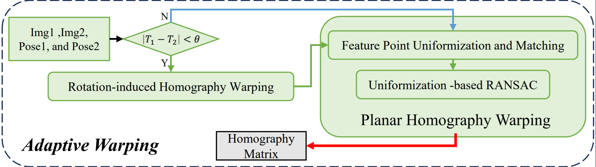
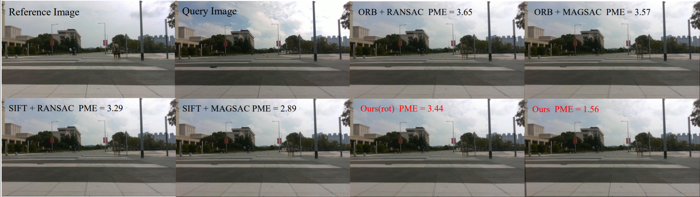
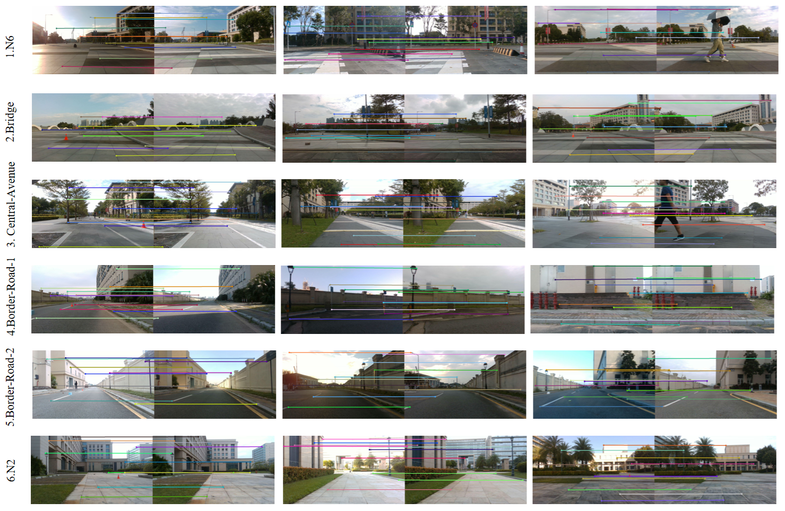
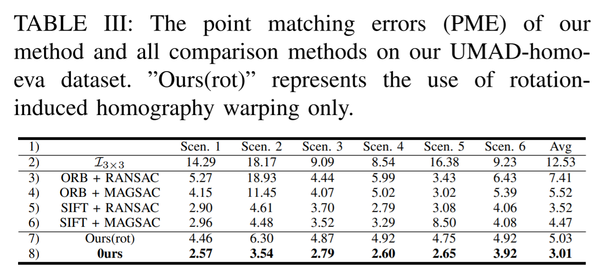

# UMAD Homography Evaluation Dataset(under maintenance)

> **UMAD Homography Evaluation Dataset(UMAD-homo-eva dataset) is part of [UMAD](https://github.com/IMRL/UMAD).**

## Introduction

The UMAD-homo-eva dataset project provides the following components: 

- [Adaptive Warping](#Adaptive-Warping),
- [UMAD-homo-eva dataset](#UMAD-homo-eva-dataset),
- [Leaderboard](#Leaderboard), 
- [Feature Correspondence Point Annotation Tool](#Feature-Correspondence-Point-Annotation-Tool).

## Adaptive Warping



Adaptive Warping is a **coarse-to-fine** image alignment (or image warping) method based on homography.



You can view more visualizations from the [UMAD IROS 2024 video](https://www.youtube.com/watch?v=xORb4H-AyNw), or obtain more comparative data from the [Leaderboard](#Leaderboard).

## UMAD-homo-eva dataset



We chose 400+ image pairs from [UMAD](https://github.com/IMRL/UMAD) original dataset; For each evaluated image pair, we manually annotated 10 uniformly distributed matching points for quantitative comparisons by pre-labeling them using traditional feature point extraction and matching methods, use it to evaluate the image alignment algorithms.

## Leaderboard



We plan to add comparisons with more learning-based methods in the future.

## Feature Correspondence Point Annotation Tool

We are optimizing this annotation tool. Currently, this annotation tool uses traditional feature point detection and matching methods (SIFT) for pre-matching, followed by manual screening, and finally allows for manual annotation.

Reference: https://github.com/daisatojp/labelMatch

## Citation

This project is part of [UMAD](https://github.com/IMRL/UMAD). If you find this work useful, please consider citing the paper:

```
@article{li2024umad
  author    = {Li, Dong and Chen, Lineng and Xu, Cheng-Zhong and Kong, Hui},
  title     = {UMAD: University of Macau Anomaly Detection Benchmark Dataset},
  journal   = {arXiv preprint arXiv:2408.12527},
  year      = {2024},
}
```